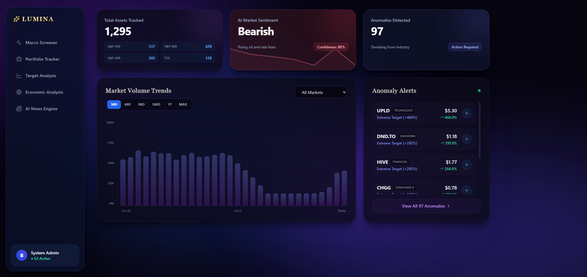
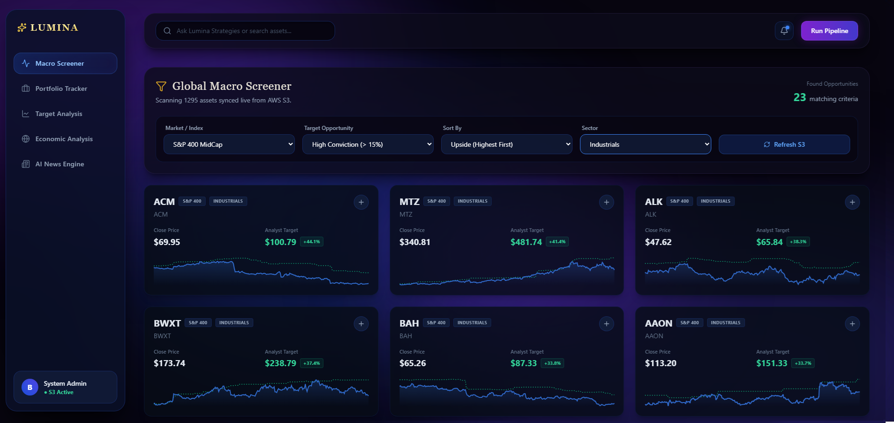
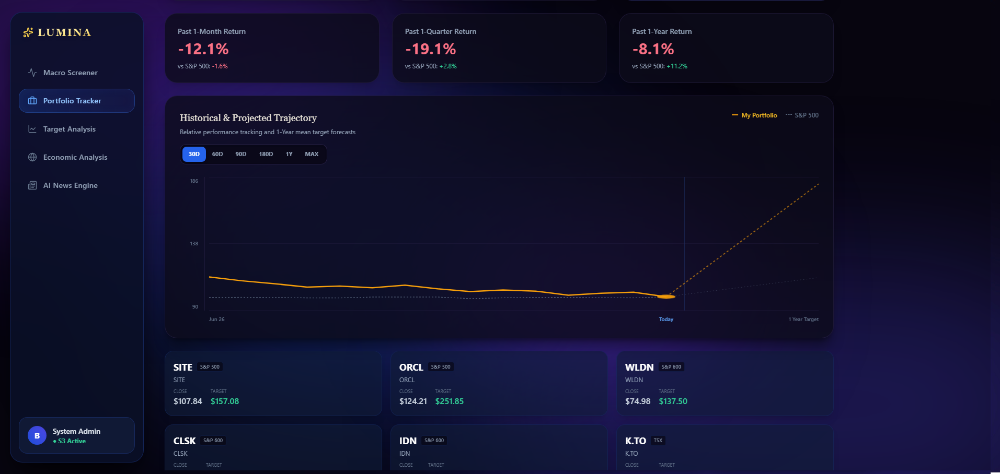
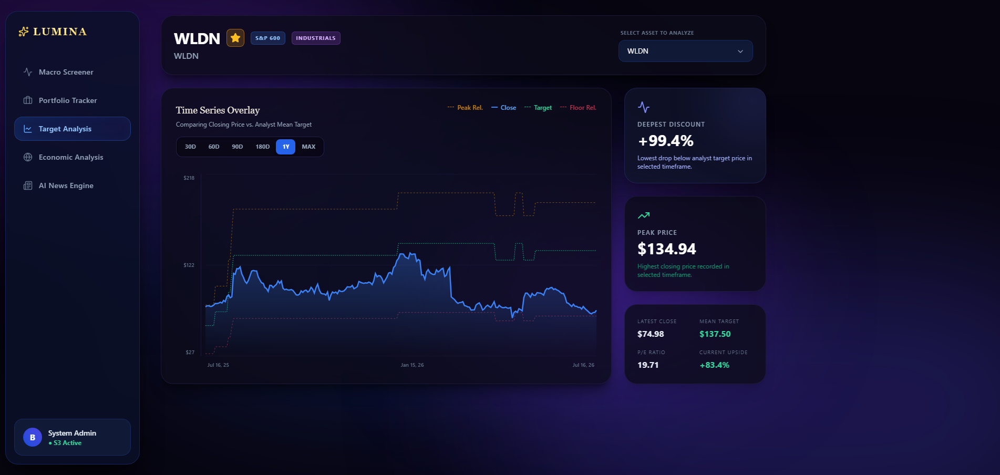
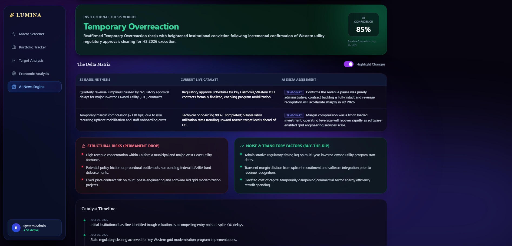

# Lumina Strategies: Serverless Quantitative AI Finance Dashboard

Lumina is a premium, serverless quantitative finance dashboard built for institutional-grade asset analysis. By leveraging a proprietary AWS data pipeline, Lumina tracks over 1,500 North American equities daily to bypass costly enterprise data subscriptions. It executes automated algorithmic scans, time-lagged macroeconomic correlation math, and AI-driven thesis synthesis, all completely decoupled from traditional web servers for near-zero operational costs.

**[🌐 View Live Dashboard](https://lumina-dashboard-red.vercel.app/)**

## Core Tech Stack
*   **Frontend & Hosting:** React (Vite), Tailwind CSS, Custom Dependency-Free SVG Charting, Vercel (CI/CD)
*   **Backend / Serverless Compute:** AWS Lambda (Python), direct Lambda Function URLs (architected to bypass API Gateway for zero-cost routing)
*   **Data Engineering & Pipelines:** AWS ECS Fargate, AWS EventBridge (Cron), Docker, Pandas
*   **Storage & Data Lake:** AWS S3 (Strict CORS & IAM Bucket Policies)
*   **AI & External Data Providers:** Google Gemini API, FRED (Federal Reserve Economic Data) API, Yahoo Finance API

## Modules & Features

### Dashboard Home & System Anomalies

*   **Command Center:** Provides a top-down architectural view of the 1,500+ tracked assets aggregated across multiple indices (S&P 500, S&P 400, S&P 600, TSX).
*   **Anomaly Detection Engine:** Mathematically scans the incoming S3 data pipeline in real-time to flag actionable deviations, such as massive volume spikes, deep value P/E ratios, and extreme target upside discrepancies.
*   **AI Market Sentiment:** Features a rolling 30-day market sentiment sparkline, driven by a scheduled AWS Lambda function that queries Google Gemini to synthesize daily macroeconomic news.
*   **Market Volume Trends:** Includes a dynamic, interactive volume trend visualization that allows users to filter aggregated market activity by specific indices and historical timeframes.
*   **Tech Used:** React (`useMemo` for high-performance array sorting), Tailwind CSS, Custom CSS Keyframes, AWS S3 (Data Lake), AWS Lambda, Google Gemini API.

### Global Macro Screener & Target Analysis

*   **User Starting Point:** Users build portfolio here for later analysis.
*   **Proprietary Data Pipeline:** Built an automated, daily collection pipeline to construct a historical dataset comparing institutional target prices against actual closing prices—circumventing the need for costly enterprise data subscriptions.
*   **Entry & Exit Optimization:** Significantly assists in identifying optimal buy and sell points by tracking the historical spread between an asset's price and its mean target.
*   **Deviation Filtering:** Features dynamic filtering capabilities to screen the market based on the intensity of the target-to-price deviation.
*   **Hypothesis Confirmation:** As the pipeline continuously aggregates daily data over time, emerging quantitative patterns are being found to confirm *reversion* to **Mean Target Price** hypothesis.
*   **Tech Used:** React, Tailwind CSS, AWS ECS Fargate (Python collection scripts), AWS EventBridge, AWS S3, AWS Lambda

### Portfolio Tracker & Trajectory Modeling

*   **Persistent Cloud State:** A seamless, cloud-synced portfolio view where saved assets are permanently stored and retrieved via an AWS Lambda to S3 connection.
*   **Deep Historical Benchmarking:** Tracks aggregated portfolio returns against customizable market indices (S&P 500, S&P 400, S&P 600, TSX). Users can scale the historical analysis from 30-day windows all the way back to the **maximum historical limit of the dataset**.
*   **Institutional Forecasting:** Calculates and projects weighted 1-month, 1-quarter, and 1-year portfolio upside targets based on aggregated institutional analyst consensus.
*   **Custom Trajectory Visualization:** Features a custom-built, dependency-free SVG graphing engine that maps historical relative performance and plots it seamlessly into forward-looking projection trajectories.
*   **Tech Used:** React, Custom SVG Math Engine, AWS Lambda (REST API for JSON state sync), AWS S3 (User configuration storage).

### Target Analysis Engine

*   **Time-Series Overlay:** A custom visualization tool comparing an asset's historical closing price directly against the shifting institutional mean target over scalable timeframes (30D back to the maximum dataset limit).
*   **Actionable Metrics:** Automatically calculates and extracts key quantitative metrics including the "Deepest Discount" (maximum percentage drop below analyst target), "Peak Price", "P/E Ratio", and real-time "Current Upside".
*   **Volatility Boundaries:** Dynamically calculates and renders "Floor" and "Peak" relative performance boundary lines to visualize how violently a stock historically swings around its institutional expectations.
*   **Tech Used:** React, Dynamic SVG coordinate generation (dependency-free custom charting), Tailwind CSS, AWS S3 (Data Lake ingestion).

### Global Macro Correlator & Time-Lag Engine

*   **Dual-Axis Macro Overlay:** Aligns asset price action against a database of 120+ macroeconomic indicators (Treasury Yields, Inflation, Unemployment, Housing) using a custom dual-axis chart with dynamic min/max bounds.
*   **Time-Lag Engine (1–6 Month Delay):** Enables quantitative analysts to offset macro timelines backwards by 1 to 6 months to uncover leading indicators where stock prices lag economic shifts.
*   **Pearson Correlation ($r$) Calculation:** Computes the mathematical Pearson Correlation coefficient in real-time across selected timeframes and lag offsets to quantify linear relationships.
*   **Persistent "Institutional Plays" Tray:** Allows users to save favorite stock, macro metric, lag, and timeframe combinations to an interactive, cloud-synced bottom tray that persists across sessions.
*   **Tech Used:** React, Custom Multi-Axis SVG Engine, Pearson Correlation Math Engine, AWS Lambda (`lumina-macro-favorites`), AWS S3 (Data Lake).

### AI News Engine & Delta Matrix

*   **Baseline Thesis Comparison:** Orchestrates serverless AI agents to compare real-time financial news sentiment against an institutional baseline thesis stored in AWS S3.
*   **The Delta Matrix:** Renders a structured 3-column analysis grid contrasting the historical baseline, the live catalyst, and the net thesis delta—complete with interactive visual diff-highlighting.
*   **Verdict Taxonomy:** Issues a clear institutional verdict—categorizing price shocks as either a **"Temporary Overreaction"** (Buy-The-Dip opportunity) or **"Permanent Failure"** (Structural Fundamental Risk)—backed by an explicit AI confidence score.
*   **Risk vs. Noise Classification:** Automatically isolates long-term structural risks from transitory market noise to help quants avoid emotional trading during earnings volatility or macro pullbacks.
*   **Chronological Catalyst Timeline:** Maps out key news events and earnings catalysts on a visual timeline with color-coded impact tags.
*   **Tech Used:** React, Google Gemini API, AWS Lambda (`lumina-ai-research`), AWS S3 (Baseline JSON repository).

### System Architecture

Lumina is a 100% serverless, decoupled quantitative finance dashboard designed for high scalability and near-zero operational costs.

*   **Client (Frontend):** A React single-page application (SPA) hosted on **Vercel** with continuous CI/CD integration. It fetches flat CSVs and JSONs directly from the data lake, completely bypassing the need for an active EC2 web server or SQL database.
*   **Data Collection (Pipelines):** Dockerized Python scripts run on an automated schedule via **AWS EventBridge** and **ECS Fargate**. They pull institutional targets and macroeconomic data from financial APIs (including FRED), process the data using Pandas, and drop flattened CSVs into the cloud.
*   **Data Lake (AWS S3):** Acts as the single source of truth. Configured with strict CORS and bucket policies to allow secure, direct access to the frontend. It manages both daily market datasets (CSVs) and persistent user configurations/research baselines (JSONs).
*   **Serverless Compute (AWS Lambda):** Handles all dynamic state-management (saving Portfolios and Institutional Plays) and orchestrates on-demand AI scraping, querying the **Google Gemini API** to synthesize live financial news. 
